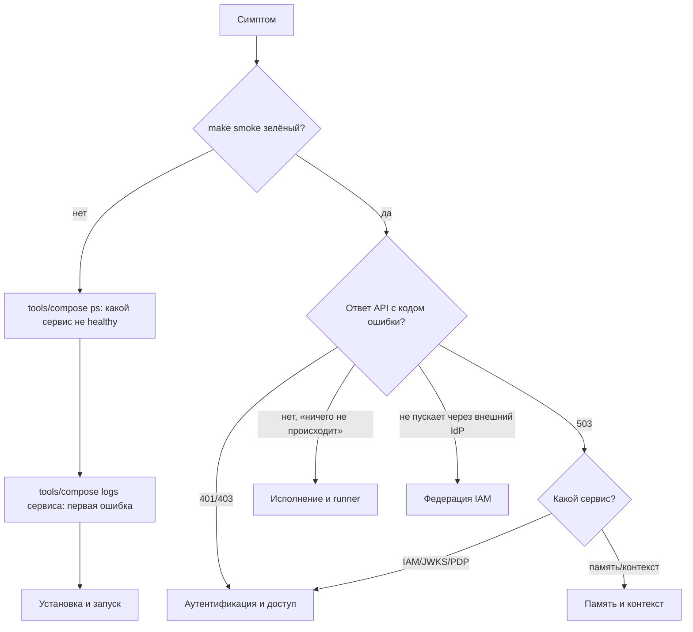

# Диагностика

Раздел собирает типичные отказы платформы Taimen в формате «симптом →
причина → решение». Статьи сгруппированы по подсистемам; начинайте с
общего порядка диагностики ниже, затем переходите к таблице своей подсистемы.

## Общий порядок



Базовые команды — из корня клона суперпроекта:

```bash
make smoke                                     # health всех запущенных сервисов
tools/compose --profile "*" ps                # статусы, healthcheck, рестарты
tools/compose logs --since 15m <сервис>       # логи
curl -s http://127.0.0.1:18000/health/ready    # готовность Control Plane
curl -s http://127.0.0.1:18000/metrics | grep context_adapter
```

## Как читать ошибки

Сервисы возвращают ошибки в разных форматах; код ошибки — главный ключ для
поиска в таблицах раздела.

| Сервис | Формат тела ошибки | Где код |
|---|---|---|
| Control Plane | `{"error": {"code", "message", "details", "requestId"}}` | `error.code`; `requestId` — ключ для поиска в логах |
| IAM | `{"detail": "<code>"}` | `detail` (например, `idempotency_key_required`) |
| Memory Service | `{"detail": "<текст>"}` | Человекочитаемый текст на русском |
| Клиент `control-plane` (CLI, MCP, runner) | Сообщение исключения | Код в начале: `iam_credential_ambiguous`, `iam_environment_mode_required` и т. п. |

!!! note "Намеренно неинформативные ответы"
    Некоторые отказы специально не раскрывают причину, чтобы API не служил
    оракулом для перебора. IAM отвечает одинаковым `401 invalid_token` на
    отозванный, истёкший, несуществующий PAT и PAT отключённого principal;
    Control Plane отвечает `401 invalid_credentials` и на битую подпись, и на
    отсутствующий binding. Точная причина — только в audit IAM и логах
    сервиса.

## Статьи раздела

| Статья | Когда открывать |
|---|---|
| [Установка и запуск](startup.md) | Не поднимается compose, контейнер `unhealthy`, ошибки сборки, миграций, прав на файлы, Caddy |
| [Аутентификация и доступ](auth.md) | `401`/`403` от IAM и Control Plane, ошибки выпуска и обмена PAT, bindings, scopes |
| [Исполнение и runner](runner.md) | Исполнитель не берёт задачи, падает, не публикует ветки, OOM, ошибки credential на runner-хосте |
| [Память и контекст](memory.md) | Доставка в память встала, контекст деградирован, `401/403/503` от памяти, медленный поиск |
| [Федерация IAM](../iam/federation.md) | Вход людей через внешний IdP: регистрация провайдера в IAM, ошибки `federation:exchange` |

## Что собрать перед обращением за помощью

- Коммит суперпроекта (`git rev-parse HEAD`) и `git submodule status`.
- Вывод `tools/compose --profile "*" ps`.
- Логи затронутого сервиса за период инцидента (без секретов: проверьте, что
  в выдержке нет токенов и паролей).
- Точный ответ API: статус, тело ошибки, `requestId` / `request_id`.
- Для исполнителя — `failure_reason` run и фрагмент лога демона.

## См. также

- [Эксплуатация](../operations/index.md)
- [Мониторинг и здоровье](../operations/monitoring.md)
- [Аварийные процедуры](../operations/emergency.md)
- [Коды ошибок](../reference/errors.md)
