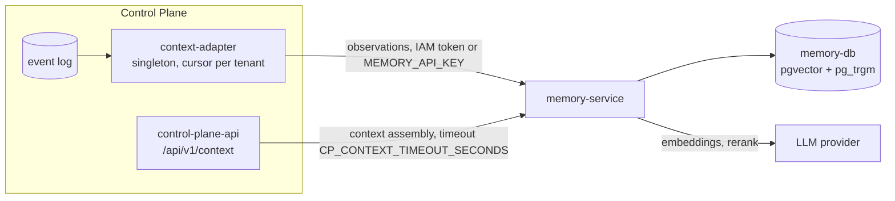

# Memory and context

Failures in delivering the Control Plane event log to memory, degraded context
for the harness, Memory Service authorization errors, and slow or inaccurate
search. This article is for operations engineers and for operators whose
agents receive empty or stale context.

## How the data path works



There are two independent paths:

- **Delivery** (asynchronous): `context-adapter` reads the event log and
  writes observations to the `tenant:<tenant-id>` namespace. A failure does
  not block coordination: the lag grows, or the tenant is parked.
- **Context assembly** (synchronous, on the harness path): `control-plane-api`
  queries memory with a short timeout (`CP_CONTEXT_TIMEOUT_SECONDS`, 3 s by
  default). If memory does not respond, the context is returned degraded, and
  the `context_degraded_total` counter grows.

## Quick diagnostics

```bash
curl -s http://127.0.0.1:18001/healthz
curl -s http://127.0.0.1:18000/metrics | grep -E '^context_'
control-plane ops adapter status
tools/compose logs --since 30m context-adapter | tail -50
tools/compose logs --since 30m memory-service | grep -iE 'error|timeout|401|403'

# check the static memory key (the endpoint requires authorization)
curl -s -H "Authorization: Bearer $MEMORY_API_KEY" http://127.0.0.1:18001/api/brain/health
```

## Delivery to memory

| Symptom | Cause | Fix |
|---|---|---|
| `context_adapter_parked_tenants > 0`, `freshness.memoryIngest.status = "parked"` | The memory provider rejected an event; the cause is in `parkedReason` (`control-plane ops adapter status`) | Fix the cause and run `control-plane ops adapter redrive <tenant-id> --reason "…"`. Redrive retries the same position; the cursor does not move |
| `parkedReason` contains `401` | The core calls memory with a wrong credential: `MEMORY_API_KEY` changed without recreating the core, or the service account was revoked | Recreate `control-plane-api control-plane-worker context-adapter`; if needed, reissue the service account (see [Secrets and rotation](../operations/secrets.md)) |
| `parkedReason` contains `403` about a namespace | The core credential has no grant on `tenant:<id>` | The core service account must have the `memory:tenants` scope; rerunning bootstrap aligns the ceiling with the registry |
| `parkedReason` mentions an unknown observation kind or schema | The core and memory versions are out of sync | Align the submodules at the superproject revisions, rebuild, redrive |
| `context_adapter_lag` grows, no parking | Memory accepts slowly (embedding provider), and the adapter falls behind | Check provider latency; `CB_EMBEDDING_TIMEOUT` (60 s in compose) |
| `context_adapter_lag_capped = 1` | The lag exceeds 1000 events | Same as above; once fixed, the adapter catches up on its own |
| The core still uses the static key after bootstrap | `CP_CONTEXT_AUTH=auto` selects IAM only if `secrets/control-plane-iam.env` existed when the container was created | `tools/compose up -d control-plane-api control-plane-worker context-adapter`; to verify, the output of `tools/compose exec context-adapter env` contains `CP_IAM_CLIENT_ID` |
| Memory was restored from an old backup, and the context is incomplete | The adapter cursor in the Control Plane database is ahead of the memory contents | `POST /api/v1/operations/context-adapter/<tenant-id>:rebuild`; memory deduplicates repeats |
| Observations are accepted, but they are not in the graph | The observation projection failed (raw records are not lost) | `GET /api/memory/observations?status=failed&namespace=…`, then an idempotent redrive with `POST /api/memory/consolidate` |

!!! note "Coordination does not depend on memory"
    While delivery is stalled, claims, runs, approvals, and task completion
    work as usual. Parking one tenant does not affect delivery for the others.

## Context assembly

| Symptom | Cause | Fix |
|---|---|---|
| The harness gets context without memory, and `context_degraded_total` grows | Memory did not respond within `CP_CONTEXT_TIMEOUT_SECONDS` (3 s) or is unavailable | Check `memory-service`; if it is slow because of the reranker or the provider, choose a faster model (`LLM_MODEL`) or disable `MEMORY_RERANK_ENABLED` |
| `context_provider_failures_total` grows | Memory returns an error on an interactive request | `memory-service` logs, codes below |
| The context is assembled, but it is the wrong one | You need to understand why these particular fragments were selected | `GET /api/memory/context/trace/{trace_id}` returns the assembly trace; the request's `run_id` (`X-Run-Id`) is recorded in memory traces |

## Memory Service errors

Memory Service responds with `{"detail": "<text>"}`; the table lists the
response texts verbatim. The service returns them in Russian; an English
rendering follows each one in parentheses.

| Status and `detail` | Cause | Fix |
|---|---|---|
| `401 Требуется корректный Authorization: Bearer <key>` ("a valid Authorization: Bearer <key> is required") | No header, a wrong static key, or an invalid IAM token (signature, expiry, `iss`, `aud` not `memory-service`) | Check the key; for an IAM token, request the `memory-service` audience during exchange |
| `503 Проверка IAM-токена недоступна (JWKS/конфигурация IAM)` ("IAM token verification unavailable (JWKS/IAM configuration)") | IAM JWKS is unavailable (fail closed); static keys keep working | Restore IAM; `CB_IAM_JWKS_URL` must point to the internal address `http://iam-service:8010/.well-known/jwks.json` |
| `403 Нет прав на namespace: <ns> (…)` ("no permission on namespace: <ns> (…)") | The credential's grant does not cover the namespace | An IAM token grants access to `tenant:<tenant_id>` and its subtree; registry keys get prefix grants |
| `403 Маршрут доступен только identity ядра (memory:service / CB_CORE_IDENTITIES)` ("route is available only to the core identity (…)") | A core route (reconcile, kind packages, namespace kinds) was called by something other than the core | Call it through Control Plane; the core service account has the `memory:service` scope |
| `403 Нужен service scope (регистрация пакетов видов)` ("service scope required (kind package registration)") | Kind package registration without a service scope | Same: go through the core |
| `503 БД недоступна: …` ("database unavailable: …") on `/healthz` | `memory-db` does not respond | `tools/compose logs memory-db`, disk, container memory |
| After an upgrade the graph is empty: `nodes` in `/healthz` is 0 or lower than before, search finds only fragments | The installation's graph stayed in Apache AGE and was not moved into the tables | `cb migrate-graph-from-age`, `--dry-run` first, see [Moving from Apache AGE](../memory/configuration.md#age-migration) |
| `404` on `/console` | The memory console is disabled (`MEMORY_CONSOLE_ENABLED=false`) | Enable it only together with authentication at the proxy; in the production layout, memory is not exposed externally |

## Search quality and speed

| Symptom | Cause | Fix |
|---|---|---|
| Search returns random fragments | The default offline providers are active: `MEMORY_EMBEDDING_PROVIDER=fake`, `MEMORY_LLM_PROVIDER=echo` | In a production installation, use `openai` (an OpenAI-compatible endpoint) and a provider key. Reload knowledge that was loaded with `fake` embeddings after switching |
| Memory queries take several seconds | The reranker (`MEMORY_RERANK_ENABLED=true`) makes an LLM call per query; the model is slow | Choose a fast model for `LLM_MODEL` and measure it on real queries, or disable reranking |
| Timeouts while loading knowledge | The embedding provider has latency spikes | `CB_EMBEDDING_TIMEOUT` (60 s in compose) |
| The confidence threshold never triggers: all results have a `score` of about 0.03 | `score` is the result of RRF fusion of channels, not a probability | Base the confidence threshold on `rerank_score` (0..1), which is present only when reranking is enabled |
| Provider errors `402`/`429` in the memory logs | The LLM provider balance or rate limit is exhausted | Top up or change the key; after recovery, redrive delivery |

!!! warning "Embedding dimension is fixed"
    The index is created for `CB_EMBEDDING_DIM` (1536 in compose). Switching
    to an embedding model with a different dimension requires recreating the
    index and reloading the knowledge.

## See also

- [Search and context assembly](../memory/retrieval.md)
- [Namespaces and access](../memory/namespaces.md)
- [Memory configuration](../memory/configuration.md)
- [Task context and memory](../control-plane/context.md)
- [Monitoring and health](../operations/monitoring.md)
