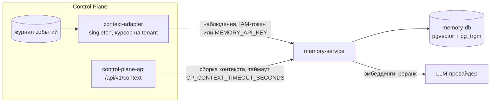

# Память и контекст

Отказы доставки журнала Control Plane в память, деградированный контекст для
harness, ошибки авторизации Memory Service, медленный или неточный поиск.
Статья для инженера эксплуатации и оператора, у которого агенты получают
пустой или устаревший контекст.

## Как устроен путь данных



Два независимых пути:

- **Доставка** (асинхронная): `context-adapter` читает журнал и пишет
  наблюдения в namespace `tenant:<tenant-id>`. Отказ не блокирует
  координацию — растёт отставание или tenant паркуется.
- **Сборка контекста** (синхронная, на пути harness): `control-plane-api`
  запрашивает память с коротким таймаутом (`CP_CONTEXT_TIMEOUT_SECONDS`, по
  умолчанию 3 с). Если память не ответила — контекст отдаётся
  деградированным, счётчик `context_degraded_total` растёт.

## Быстрая диагностика

```bash
curl -s http://127.0.0.1:18001/healthz
curl -s http://127.0.0.1:18000/metrics | grep -E '^context_'
control-plane ops adapter status
tools/compose logs --since 30m context-adapter | tail -50
tools/compose logs --since 30m memory-service | grep -iE 'error|timeout|401|403'

# проверить статический ключ памяти (эндпоинт требует авторизации)
curl -s -H "Authorization: Bearer $MEMORY_API_KEY" http://127.0.0.1:18001/api/brain/health
```

## Доставка в память

| Симптом | Причина | Решение |
|---|---|---|
| `context_adapter_parked_tenants > 0`, `freshness.memoryIngest.status = "parked"` | Провайдер памяти отверг событие; причина — в `parkedReason` (`control-plane ops adapter status`) | Устранить причину и `control-plane ops adapter redrive <tenant-id> --reason "…"`. Redrive повторяет ту же позицию, курсор не двигается |
| `parkedReason` содержит `401` | Ядро ходит в память с неверным credential: сменился `MEMORY_API_KEY` без пересоздания ядра или отозван service account | Пересоздать `control-plane-api control-plane-worker context-adapter`; при необходимости перевыпустить service account (см. [Секреты и ротация](../operations/secrets.md)) |
| `parkedReason` содержит `403` про namespace | Credential ядра не имеет гранта на `tenant:<id>` | Service account ядра должен иметь scope `memory:tenants`; повторный bootstrap приводит потолок к реестру |
| `parkedReason` про неизвестный вид или схему наблюдения | Версии ядра и памяти рассинхронизированы | Выровнять сабмодули на ревизиях суперпроекта, пересобрать, redrive |
| `context_adapter_lag` растёт, парковки нет | Память медленно принимает (провайдер эмбеддингов), адаптер отстаёт | Проверить задержки провайдера; `CB_EMBEDDING_TIMEOUT` (в compose — 60 с) |
| `context_adapter_lag_capped = 1` | Отставание больше 1000 событий | То же; после устранения адаптер догонит сам |
| Ядро продолжает ходить статическим ключом после bootstrap | `CP_CONTEXT_AUTH=auto` выбирает IAM, только если при создании контейнера был `secrets/control-plane-iam.env` | `tools/compose up -d control-plane-api control-plane-worker context-adapter`; проверка: в выводе `tools/compose exec context-adapter env` есть `CP_IAM_CLIENT_ID` |
| Память восстановлена из старого бэкапа, контекст неполный | Курсор адаптера в базе Control Plane впереди содержимого памяти | `POST /api/v1/operations/context-adapter/<tenant-id>:rebuild`; память дедуплицирует повторы |
| Наблюдения приняты, но в графе их нет | Проекция наблюдения не удалась (сырые записи не теряются) | `GET /api/memory/observations?status=failed&namespace=…`, затем идемпотентный redrive `POST /api/memory/consolidate` |

!!! note "Координация от памяти не зависит"
    Пока доставка стоит, claims, runs, approvals и завершение задач работают
    как обычно. Парковка одного tenant не мешает доставке остальных.

## Сборка контекста

| Симптом | Причина | Решение |
|---|---|---|
| Harness получает контекст без памяти, растёт `context_degraded_total` | Память не ответила за `CP_CONTEXT_TIMEOUT_SECONDS` (3 с) или недоступна | Проверить `memory-service`; если медленно из-за реранкера или провайдера — выбрать более быструю модель (`LLM_MODEL`) или выключить `MEMORY_RERANK_ENABLED` |
| Растёт `context_provider_failures_total` | Память отвечает ошибкой на интерактивный запрос | Логи `memory-service`, коды ниже |
| Контекст собран, но не тот | Нужно понять, почему выбраны именно эти фрагменты | `GET /api/memory/context/trace/{trace_id}` — трасса сборки; `run_id` запроса (`X-Run-Id`) попадает в трассы памяти |

## Ошибки Memory Service

Memory Service отвечает `{"detail": "<текст>"}`; ниже — тексты ответов.

| Статус и `detail` | Причина | Решение |
|---|---|---|
| `401 Требуется корректный Authorization: Bearer <key>` | Нет заголовка, неверный статический ключ или невалидный IAM-токен (подпись, срок, `iss`, `aud` не `memory-service`) | Проверить ключ; для IAM-токена — audience `memory-service` при обмене |
| `503 Проверка IAM-токена недоступна (JWKS/конфигурация IAM)` | JWKS IAM недоступен (fail closed); статические ключи при этом продолжают работать | Восстановить IAM; `CB_IAM_JWKS_URL` должен указывать на внутренний адрес `http://iam-service:8010/.well-known/jwks.json` |
| `403 Нет прав на namespace: <ns> (…)` | Грант credential не покрывает namespace | IAM-токен даёт доступ к `tenant:<tenant_id>` и его поддереву; ключам реестра — гранты по префиксу |
| `403 Маршрут доступен только identity ядра (memory:service / CB_CORE_IDENTITIES)` | Маршрут ядра (reconcile, пакеты видов, виды namespace) вызван не ядром | Вызывать через Control Plane; service account ядра имеет scope `memory:service` |
| `403 Нужен service scope (регистрация пакетов видов)` | Регистрация пакета видов без service scope | То же: через ядро |
| `503 БД недоступна: …` на `/healthz` | `memory-db` не отвечает | `tools/compose logs memory-db`, диск, память контейнера |
| После обновления граф пуст: `nodes` в `/healthz` — 0 или меньше прежнего, поиск находит только фрагменты | Граф установки остался в Apache AGE и не перенесён в таблицы | `cb migrate-graph-from-age`, сначала `--dry-run`, см. [Переход с Apache AGE](../memory/configuration.md#age-migration) |
| `404` на `/console` | Консоль памяти выключена (`MEMORY_CONSOLE_ENABLED=false`) | Включать только вместе с аутентификацией на прокси; наружу в промышленной раскладке память не публикуется |

## Качество и скорость поиска

| Симптом | Причина | Решение |
|---|---|---|
| Поиск возвращает случайные фрагменты | Работают офлайн-провайдеры по умолчанию: `MEMORY_EMBEDDING_PROVIDER=fake`, `MEMORY_LLM_PROVIDER=echo` | В промышленной установке — `openai` (OpenAI-совместимый endpoint) и ключ провайдера. Знания, загруженные с `fake`-эмбеддингами, после переключения стоит загрузить заново |
| Запросы к памяти занимают несколько секунд | Реранкер (`MEMORY_RERANK_ENABLED=true`) делает LLM-вызов на запрос; медленная модель | Выбрать быструю модель для `LLM_MODEL` и замерить на реальных запросах; либо выключить реранк |
| Таймауты при загрузке знаний | Провайдер эмбеддингов даёт пики задержки | `CB_EMBEDDING_TIMEOUT` (в compose — 60 с) |
| Порог уверенности не срабатывает: у всех результатов `score` около 0,03 | `score` — результат RRF-слияния каналов, а не вероятность | Порог уверенности строить по `rerank_score` (0..1), он есть только при включённом реранке |
| Ошибки провайдера `402`/`429` в логах памяти | Закончился баланс или лимит у LLM-провайдера | Пополнить или сменить ключ; после восстановления — redrive доставки |

!!! warning "Размерность эмбеддингов фиксирована"
    Индекс создаётся под `CB_EMBEDDING_DIM` (в compose — 1536). Смена модели
    эмбеддингов на модель другой размерности требует пересоздания индекса и
    повторной загрузки знаний.

## См. также

- [Поиск и сборка контекста](../memory/retrieval.md)
- [Namespaces и доступ](../memory/namespaces.md)
- [Конфигурация памяти](../memory/configuration.md)
- [Контекст задачи и память](../control-plane/context.md)
- [Мониторинг и здоровье](../operations/monitoring.md)
