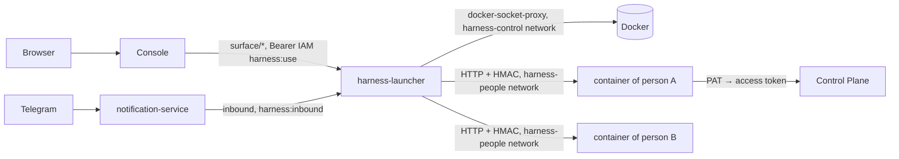

# Personal workspace

A personal workspace is a person's own assistant container on top of Control Plane: it holds
the conversation, the conversation memory, and working copies. A person talks to the
assistant from the [console](../operator/console.md) panel and [from Telegram](telegram.md) —
it is a single conversation. This page is for the administrator who deploys personal
workspaces; how to use the assistant is described in [Assistant](../operator/assistant.md).
Rationale: TAI-ADR-0051 and TAI-ADR-0058 (rev. 2).

## What the assistant does

The assistant reads tasks, approvals, events, and company memory with Control Plane tools and
answers from them, not from the conversation's memory. The core computes the Waiting for you
list (`GET /api/v1/me/attention`, CP-ADR-0071), and the console shows it on the Today screen;
the assistant gets it with the same call.

### The assistant comes by itself

When something that concerns the person happens, the assistant writes to the conversation
without being asked: "the result of your assignment is ready — accept it?". What counts as
significant is set by rules (`attention-rules.json`, see [below](#attention-rules)). Events
within 20 seconds are combined into one message. Secondary events and everything that happened
while the person was away (more than 10 minutes without opening the conversation) the
assistant collects into a single "while you were away" summary and writes it when the person
opens the assistant panel in the console.

Reminders ("remind me on Friday to check the report") the assistant sets in the same
conversation and comes back with them by itself at the scheduled time.

### Tools

| Action | Tools | How |
|---|---|---|
| Find out who the person is and what is waiting | `cp_whoami`, `cp_attention`, `cp_find_tasks`, `cp_get_task` | Read |
| Assign work to an agent or a person | `cp_agents`, `cp_delegate` | A draft: what, to whom, acceptance criteria, deadline — then confirmation |
| Follow progress and accept the result | `cp_run_progress`, `cp_review` | Shows the evidence before acceptance; a return comes with a specific remark, which becomes the assignment for the next iteration |
| Do one's own work | `cp_take_task`, `cp_checkpoint`, `cp_register_artifact`, `cp_complete_task`, `cp_release_task`, `cp_active_work` | Claim and run on behalf of the person; the core verifies the result, as for an agent |
| Invoke a registry skill | `cp_invoke_skill` | Shows what will change outside |
| Tasks, comments, decisions | `cp_create_task`, `cp_update_task`, `cp_comment_task`, `cp_decide_approval` | Mutation |
| Company memory | `cp_recall`, `cp_remember` | Through Control Plane |
| Choose a workspace | `cp_workspaces`, `cp_select_workspace` | Narrows the search |

!!! note "Every mutation requires the person's confirmation"
    A tool that changes state in the core does not run without explicit confirmation — in the
    console panel or with a button in Telegram; the first answer counts. The permissions are
    the person's own permissions in Control Plane: the assistant cannot do more than the
    person.

### Privacy

Only its owner sees the conversation. The organization sees core objects and the action log
(tasks, approvals, artifacts, events), but not the correspondence. When a principal is
disabled in IAM, its conversation and working copies are deleted within a minute.

## How it works



- **A container per person.** The launcher creates it from the `human-harness` image on first
  access: the `harness-data-<principal>` volume at `/data` (conversation, working copies) and
  the person's secrets directory, read-only. The container exposes no ports.
- **Entry.** The personal workspace has no web interface of its own. The console and the
  notification service call the launcher over the compose network with an IAM token: the
  console with the person's token (audience `human-harness`, scope `harness:use`, the token's
  principal matches the address), the notification service with its own service account
  (`harness:inbound`). A request goes into the container with the `X-Harness-Launcher` header
  (HMAC with the container's secret); without it the container answers `401`. The edge lets
  through to the launcher only these service routes (`/harness/_launcher/internal/*`) and
  health; the browser's `/harness/` leads to the console with the assistant panel open (see
  [Edge and TLS](../operations/edge-and-tls.md)).
- **Identity in the core.** The container acts with the person's Platform Access Token
  (read+write, without admin), which bootstrap issues.
- **Model.** The assistant's turn is executed by Claude Code on the person's subscription
  (`claude-oauth-token`). The token is read on every turn and passed only to the Claude Code
  process.
- **Sleep.** After 30 minutes without messages and without a turn in progress, the container
  stops; it wakes up for the nearest reminder or on the next message. An open console panel
  does not postpone sleep. A cold start takes seconds.

## Isolation and networks {#isolation}

**The person's container is untrusted.** The model in it has a shell, and the text it reads
(tasks, documents, emails, pages) may carry someone else's instructions (prompt injection).
That is why the boundary is drawn not by the model's behavior but by what is available to the
container.

| Threat | How it is closed |
|---|---|
| Calling the Docker API from the container (`POST /containers/create` with `Privileged` and `Binds: /`) to get root on the host | The Docker proxy sits only in the internal `harness-control` network together with the launcher; its name and address do not exist in the people's network |
| Reading other people's `harness-data-*` volumes and `secrets/harness/<principal>` directories | The Docker API is unavailable; the launcher mounts into a container only its own volume and its own secrets directory (the directory name is the principal) |
| Reaching databases, MinIO, Keycloak, iam-service, memory-service directly | They are not in the `harness-people` network; IAM and everything else only through the edge (caddy), as from the internet |
| Escalating privileges inside the container, exhausting host resources | uid 10001, `CapDrop: ALL`, `no-new-privileges`, `Privileged: false`; a memory limit; CPU and process-count limits — with the launcher version with isolation (part of v0.1.0) |
| Tampering with the container specification the launcher sends | The proxy does not parse the request body, so the launcher builds the specification itself; with the launcher version with isolation (part of v0.1.0) it also rejects everything except the pinned image, its own mounts, and its own network (not `host`, `bridge`, `container:*`) |

Networks of the `harness` profile:

| Network | Who is in it | Why |
|---|---|---|
| `harness-control` (`internal`, no outbound access) | `harness-docker-proxy`, `harness-launcher` | The Docker API — only for the launcher |
| `harness-people` | people's containers, `harness-launcher`, `control-plane-api`, `notification-service`, `caddy` (alias `TAIMEN_PUBLIC_HOST`) | The core (`cp_*` tools), the channel (Telegram), IAM at the public address, the launcher's entry into the container; outbound internet — the Anthropic API and the forge |
| `taimen` (the main compose network) | all services, including `harness-launcher` | The launcher calls iam-service and Keycloak; the console and the notification service call the launcher |

The launcher places people's containers in `LAUNCHER_NETWORK` — the full name of the
`harness-people` network (`<COMPOSE_PROJECT_NAME>_harness-people`, overridden by
`HARNESS_PEOPLE_NETWORK`). A stopped container created with the previous specification or in
another network is recreated on wake-up with the launcher version with isolation (part of
v0.1.0); the volume with the conversation remains. With the previous launcher, such a
container is removed manually (`docker rm -f harness-<principal>`; the volume remains), and the
launcher creates it again on the next message.

!!! warning "What remains open"
    - People's containers see each other in `harness-people` (port 3080). The conversation and
      service routes are closed with the container's secret (the launcher's HMAC), but there
      is no network isolation between people.
    - `control-plane-api` in the people's network also answers on `/metrics` (without
      authentication, only counters), which the edge does not expose.
    - The launcher is a trust boundary: whoever executes code in it gets the Docker API.

## Deployment

You need the `core`, `idp` (Keycloak), and `edge` profiles; personal workspaces are the
`harness` profile of `deploy/local/compose.yml`:

| Service | What it does |
|---|---|
| `harness-image` | Only builds the personal workspace image (`up` finishes the service immediately) |
| `harness-docker-proxy` | The Docker API for the launcher: only containers and volumes; exec, images, networks, build are closed. Visible only to the launcher (the `harness-control` network) |
| `harness-launcher` | The conversation's service routes (console, channels), the container lifecycle |

```bash
make up PROFILES="core idp harness edge"
make bootstrap ARGS="--harness-people deploy/harness-people.json"
```

### People registry

`deploy/harness-people.json` lists who has a personal workspace:

```json
{
  "people": [
    {"iamPrincipalId": "operator"},
    {"iamPrincipalId": "<principal-id>", "name": "Alice Example", "email": "alice@example.com"}
  ]
}
```

`"operator"` is the bootstrap operator. `name` and `email` become the author of the person's
commits. Step 8 of bootstrap, for each person:

1. issues a PAT (`control-plane:read`, `control-plane:write`) and writes
   `secrets/harness/<principal-id>/credentials.json`;
2. writes the launcher's cookie key `secrets/harness/cookie-secret` and the registry
   `secrets/harness/people.json`;
3. registers the `human-harness` audience (`harness:use`, `harness:inbound`).

Files the person puts into their own `secrets/harness/<principal-id>/` directory themselves
(permissions `0600`):

| File | What | Without it |
|---|---|---|
| `claude-oauth-token` | Claude subscription token (`claude setup-token`) | The assistant answers with an authorization message; Waiting for you still works |
| `forge-token` | Personal forge token (github.com) | No access to private repositories |

!!! warning "Permissions on Linux"
    The launcher and the containers run as uid 10001. The `secrets/harness` directory must be
    owned by this uid: `chown -R 10001:10001 secrets/harness`.

### Keycloak and IAM

- A person signs in to the [console](../operator/console.md); its server obtains for them a
  token for the `human-harness` audience with the `harness:use` scope through the same
  `federation:exchange` as the other tokens. Bootstrap registers the audience.
- IAM needs a `keycloak` identity provider with the `iam-service` audience and a link between
  the person's external identity and their principal — see
  [Identity federation](../iam/federation.md) and the procedure for
  [onboarding a person](../iam/keycloak.md#onboarding).
- The Keycloak client `human-harness` (public, PKCE S256) stays in the realm template for the
  launcher's own sign-in; this sign-in is not available through the edge.
- Permissions of the person's binding in Control Plane: `tasks.claim` for their own work,
  `skills.invoke` for skills.

### Launcher variables

| Variable | Value in compose |
|---|---|
| `LAUNCHER_PUBLIC_URL` | `${TAIMEN_PUBLIC_URL}/harness` |
| `LAUNCHER_WINDOW_URL` | Not set: the "Open window" link in Telegram answers leads to `<LAUNCHER_PUBLIC_URL host>/console/?assistant=open`; the container gets it as `HARNESS_WINDOW_URL` |
| `LAUNCHER_OIDC_ISSUER`, `LAUNCHER_OIDC_CLIENT_ID` | realm `platform`, client `human-harness` |
| `LAUNCHER_IAM_URL`, `LAUNCHER_IAM_ISSUER`, `LAUNCHER_IAM_TENANT` | IAM inside the network, the public issuer, `IAM_TENANT_ID` |
| `LAUNCHER_IAM_BOOTSTRAP_TOKEN_FILE` | The IAM bootstrap token — the only way to get a principal's status for deleting the conversations of disabled principals |
| `LAUNCHER_IMAGE`, `LAUNCHER_NETWORK` | The personal workspace image and the compose network |
| `LAUNCHER_HARNESS_MEMORY_MB`, `LAUNCHER_IDLE_MINUTES` | `HARNESS_MEM_LIMIT_MB` (1536), `HARNESS_IDLE_MINUTES` (30) |
| `LAUNCHER_HARNESS_ENV` | The container environment: core address, IAM, tenant, `HARNESS_APP_NAME`, `HARNESS_TRUSTED_HOSTS` |

The application name is set by `HARNESS_APP_NAME`; the company name is taken from the tenant.

!!! note "The container environment is fixed at creation"
    The launcher creates a person's container once and afterwards only starts and stops it.
    The container gets a new image or a new value of `LAUNCHER_WINDOW_URL` or
    `LAUNCHER_HARNESS_ENV` only after being recreated:
    `docker rm -f harness-<principal-id>` — the volume with the conversation remains, and the
    launcher creates the container again on the next access.

### Launcher log

JSON lines on stdout (`tools/compose logs harness-launcher`):

| Event | When |
|---|---|
| `surface.access`, `surface.error` | The console accesses a person's conversation; a failure |
| `inbound`, `inbound.delivered` | A message or a decision from a channel; delivered into the container |
| `container.created`, `container.started`, `container.ready` | Start; `ms` is the time until ready |
| `container.slept`, `container.woken` | Sleep and wake-up for a reminder |
| `conversation.deleted` | The principal was disabled or deleted — the container and the volume are deleted |
| `sweep.disabled` | No IAM bootstrap token — deletion of conversations is disabled |

## Significance rules { #attention-rules }

Default rules ship with the personal workspace; an installation can replace them with its own
file (`HARNESS_ATTENTION_RULES` in the container environment). Rules are checked in order, and
the first matching one applies.

| Field | Meaning |
|---|---|
| `key`, `version` | The `key@version` identity, visible on every item |
| `on` | Exact core event types |
| `concerns` | `approval-mine`, `task-assignee`, `task-creator`, `task-involves`, `any` |
| `when` | Conditions on event fields, dot-separated; `"$me"` is the person's principal |
| `skipOwnActions` | Skip the person's own actions (default `true`) |
| `significance` | `now` — the assistant comes by itself; `digest` — only into the summary |
| `message`, `action` | `{{path}}` templates: what happened and which action to suggest |

```json
{
  "key": "delegation.run-succeeded",
  "version": 1,
  "on": ["run.succeeded"],
  "concerns": "task-creator",
  "significance": "now",
  "message": "The executor finished the work on {{task.publicId}} \"{{task.title}}\".",
  "action": "Review the result and suggest acceptance or the next step."
}
```

## Common problems

| Symptom | Cause and what to do |
|---|---|
| Assistant panel: `principal_unknown` (`404`) | The principal is not in `secrets/harness/people.json`: add it to the registry, rerun bootstrap, restart the launcher |
| Assistant panel: `unauthorized` (`401`) or `forbidden` (`403`) | The console's token lacks the `human-harness` audience or the `harness:use` scope — check the audience in IAM, rerun bootstrap |
| Panel: "The assistant did not wake up in time" | The container did not answer within 30 s: `docker logs harness-<principal-id>` |
| The assistant answers "Claude Code is not authorized" | `claude-oauth-token` is missing or expired; the file is reread on every turn, no restart is needed |
| The "Open window" link in Telegram does not lead to the console | The container was created before `LAUNCHER_WINDOW_URL` or the image changed — recreate it |

## See also

- [Assistant](../operator/assistant.md) — the assistant panel in the console
- [Console](../operator/console.md) — visibility and management of the whole organization
- [Assistant in Telegram](telegram.md)
- [Approvals](../control-plane/approvals.md)
- [Events](../control-plane/events.md)
- [Identity federation](../iam/federation.md)
- [Credentials and PAT](../iam/credentials.md)
