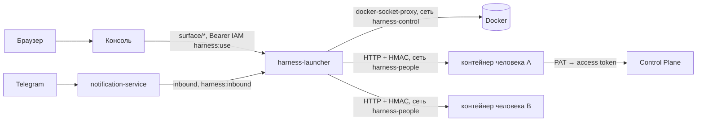

# Рабочее место человека

Рабочее место — персональный контейнер ассистента человека поверх Control Plane: в нём
живёт беседа, память разговора и рабочие копии. Человек говорит с ассистентом из панели
[консоли](../operator/console.md) и [из Telegram](telegram.md) — беседа одна. Страница для
администратора, который разворачивает рабочие места; как пользоваться ассистентом —
[Ассистент](../operator/assistant.md). Обоснование решений — TAI-ADR-0051 и TAI-ADR-0058
(ред. 2).

## Что делает ассистент

Ассистент читает задачи, согласования, события и память компании инструментами Control
Plane и отвечает по ним, а не по памяти диалога. Список «Ждёт вас» считает ядро
(`GET /api/v1/me/attention`, CP-ADR-0071) и показывает пульс консоли; ассистент берёт его
тем же вызовом.

### Ассистент приходит сам

Когда происходит то, что касается человека, ассистент пишет в беседу без вопроса:
«результат по поручению готов — принять?». Что считать значимым, задают правила
(`attention-rules.json`, см. [ниже](#attention-rules)). События за 20 секунд
сводятся в одно сообщение. Второстепенное и всё, что случилось, пока человека не было
(больше 10 минут без открытия беседы), ассистент собирает в одну сводку «пока вас не
было» и пишет её, когда человек открывает панель ассистента в консоли.

Напоминания («напомни в пятницу проверить отчёт») ассистент ставит в той же беседе и
в назначенное время приходит с ними сам.

### Инструменты

| Действие | Инструменты | Как |
|---|---|---|
| Узнать, кто человек и что ждёт | `cp_whoami`, `cp_attention`, `cp_find_tasks`, `cp_get_task` | Чтение |
| Поручить работу агенту или человеку | `cp_agents`, `cp_delegate` | Черновик: что, кому, критерии готовности, срок — затем подтверждение |
| Следить за ходом и принять результат | `cp_run_progress`, `cp_review` | Перед приёмкой показывает evidence; возврат — с конкретным замечанием, оно станет заданием следующей итерации |
| Сделать свою работу | `cp_take_task`, `cp_checkpoint`, `cp_register_artifact`, `cp_complete_task`, `cp_release_task`, `cp_active_work` | Claim и run от имени человека; результат проверяет ядро, как у агента |
| Вызвать скилл реестра | `cp_invoke_skill` | Показывает, что изменится снаружи |
| Задачи, комментарии, решения | `cp_create_task`, `cp_update_task`, `cp_comment_task`, `cp_decide_approval` | Мутация |
| Память компании | `cp_recall`, `cp_remember` | Через Control Plane |
| Выбрать workspace | `cp_workspaces`, `cp_select_workspace` | Сужает поиск |

!!! note "Каждая мутация — с подтверждением человека"
    Инструмент, который меняет состояние в ядре, не выполняется без явного
    подтверждения — в панели консоли или кнопкой в Telegram, засчитывается первый ответ.
    Права — права самого человека в Control Plane: ассистент не может больше, чем
    человек.

### Приватность

Беседу видит только её владелец. Организации видны объекты ядра и журнал действий
(задачи, согласования, артефакты, события), но не переписка. Когда principal
отключают в IAM, его беседа и рабочие копии удаляются не позже чем через минуту.

## Как это устроено



- **Контейнер на человека.** Launcher создаёт его из образа `human-harness` при первом
  обращении: volume `harness-data-<principal>` в `/data` (беседа, рабочие копии), каталог
  секретов человека — только на чтение. Портов наружу у контейнера нет.
- **Вход.** Своего веб-интерфейса у рабочего места нет. Консоль и сервис уведомлений
  ходят в launcher по сети compose с токеном IAM: консоль — токеном человека (audience
  `human-harness`, scope `harness:use`, principal токена совпадает с адресом), сервис
  уведомлений — своим service account (`harness:inbound`). В контейнер запрос уходит с
  заголовком `X-Harness-Launcher` (HMAC секретом контейнера), без него контейнер
  отвечает `401`. Периметр пропускает к launcher'у только эти служебные маршруты
  (`/harness/_launcher/internal/*`) и health; браузерный `/harness/` ведёт в консоль с
  открытой панелью ассистента (см. [Периметр и TLS](../operations/edge-and-tls.md)).
- **Identity в ядре.** Контейнер действует Platform Access Token человека (read+write,
  без admin), который выпускает bootstrap.
- **Модель.** Ход ассистента исполняет Claude Code по подписке человека
  (`claude-oauth-token`). Токен читается на каждый ход и передаётся только процессу
  Claude Code.
- **Сон.** После 30 минут без сообщений и без идущего хода контейнер останавливается и
  просыпается к ближайшему напоминанию или при следующем сообщении. Открытая панель
  консоли сон не откладывает. Холодный старт — секунды.

## Изоляция и сети {#isolation}

**Контейнер человека — недоверенный.** У модели в нём есть shell, а текст, который она
читает (задачи, документы, письма, страницы), может нести чужие инструкции (prompt
injection). Поэтому граница проходит не по поведению модели, а по тому, что контейнеру
доступно.

| Угроза | Чем закрыта |
|---|---|
| Из контейнера вызвать Docker API (`POST /containers/create` с `Privileged` и `Binds: /`) и получить root на хосте | Прокси Docker стоит только во внутренней сети `harness-control` вместе с launcher'ом; из сети людей его имени и адреса нет |
| Прочитать чужие volume `harness-data-*` и каталоги `secrets/harness/<principal>` | Docker API недоступен; launcher монтирует контейнеру только его volume и его каталог секретов (имя каталога — principal) |
| Достучаться до баз, MinIO, Keycloak, iam-service, memory-service напрямую | Их нет в сети `harness-people`; IAM и остальное — только через периметр (caddy), как из интернета |
| Поднять привилегии внутри контейнера, исчерпать ресурсы хоста | uid 10001, `CapDrop: ALL`, `no-new-privileges`, `Privileged: false`; лимит памяти; лимиты CPU и числа процессов — с launcher'ом версии с изоляцией (войдёт в v0.1.0) |
| Подменить launcher'у спецификацию контейнера | Прокси тело запроса не разбирает, поэтому launcher собирает её сам; с launcher'ом версии с изоляцией (войдёт в v0.1.0) он ещё и отвергает всё, кроме закреплённого образа, своих монтирований и своей сети (не `host`, `bridge`, `container:*`) |

Сети профиля `harness`:

| Сеть | Кто в ней | Зачем |
|---|---|---|
| `harness-control` (`internal`, без выхода наружу) | `harness-docker-proxy`, `harness-launcher` | Docker API — только launcher'у |
| `harness-people` | контейнеры людей, `harness-launcher`, `control-plane-api`, `notification-service`, `caddy` (alias `TAIMEN_PUBLIC_HOST`) | Ядро (инструменты `cp_*`), канал (Telegram), IAM по публичному адресу, вход launcher'а в контейнер; выход в интернет — Anthropic API и forge |
| `taimen` (основная сеть compose) | все сервисы, включая `harness-launcher` | launcher ходит в iam-service и Keycloak, консоль и сервис уведомлений — в launcher |

Launcher ставит контейнеры людей в `LAUNCHER_NETWORK` — полное имя сети `harness-people`
(`<COMPOSE_PROJECT_NAME>_harness-people`, переопределяется `HARNESS_PEOPLE_NETWORK`).
Остановленный контейнер, созданный по прежней спецификации или в другой сети,
пересоздаётся при пробуждении с launcher'ом версии с изоляцией (войдёт в v0.1.0);
volume с беседой остаётся. С прежним
launcher'ом такой контейнер удаляют вручную (`docker rm -f harness-<principal>`, volume
остаётся), и launcher создаёт его заново при следующем сообщении.

!!! warning "Что остаётся открытым"
    - Контейнеры людей видят друг друга в `harness-people` (порт 3080). Беседа и служебные
      маршруты закрыты секретом контейнера (HMAC launcher'а), но сетевой изоляции между
      людьми нет.
    - `control-plane-api` в сети людей отвечает и на `/metrics` (без аутентификации,
      только счётчики), который периметр не выводит.
    - Launcher — граница доверия: кто исполнит код в нём, получит Docker API.

## Развёртывание

Нужны профили `core`, `idp` (Keycloak) и `edge`; рабочие места — профиль
`harness` `deploy/local/compose.yml`:

| Сервис | Что делает |
|---|---|
| `harness-image` | Только сборка образа рабочего места (`up` сразу завершает сервис) |
| `harness-docker-proxy` | Docker API для launcher: только контейнеры и volume; exec, images, networks, build закрыты. Виден только launcher'у (сеть `harness-control`) |
| `harness-launcher` | Служебные маршруты беседы (консоль, каналы), жизненный цикл контейнеров |

```bash
make up PROFILES="core idp harness edge"
make bootstrap ARGS="--harness-people deploy/harness-people.json"
```

### Реестр людей

`deploy/harness-people.json` — кому выдано рабочее место:

```json
{
  "people": [
    {"iamPrincipalId": "operator"},
    {"iamPrincipalId": "<principal-id>", "name": "Alice Example", "email": "alice@example.com"}
  ]
}
```

`"operator"` — оператор bootstrap. `name` и `email` становятся автором коммитов человека.
Шаг 8 bootstrap для каждого человека:

1. выпускает PAT (`control-plane:read`, `control-plane:write`) и пишет
   `secrets/harness/<principal-id>/credentials.json`;
2. пишет ключ cookie launcher'а `secrets/harness/cookie-secret` и реестр
   `secrets/harness/people.json`;
3. регистрирует audience `human-harness` (`harness:use`, `harness:inbound`).

Файлы, которые человек кладёт в свой каталог `secrets/harness/<principal-id>/` сам
(права `0600`):

| Файл | Что | Без него |
|---|---|---|
| `claude-oauth-token` | Токен подписки Claude (`claude setup-token`) | Ассистент отвечает сообщением об авторизации; «Важное» работает |
| `forge-token` | Личный токен forge (github.com) | Нет доступа к приватным репозиториям |

!!! warning "Права на Linux"
    Launcher и контейнеры работают под uid 10001. Каталог `secrets/harness` должен
    принадлежать этому uid: `chown -R 10001:10001 secrets/harness`.

### Keycloak и IAM

- Человек входит в [консоль](../operator/console.md); её сервер получает для него токен
  audience `human-harness` со scope `harness:use` тем же `federation:exchange`, что и
  остальные токены. Audience заводит bootstrap.
- В IAM нужен identity provider `keycloak` с audience `iam-service` и связь внешней
  identity человека с его principal — см. [Федерация identity](../iam/federation.md)
  и порядок [заведения человека](../iam/keycloak.md#onboarding).
- Клиент Keycloak `human-harness` (public, PKCE S256) остаётся в шаблоне realm для
  собственного входа launcher'а; через периметр этот вход недоступен.
- Права binding человека в Control Plane: для своей работы — `tasks.claim`, для скиллов —
  `skills.invoke`.

### Переменные launcher

| Переменная | Значение в compose |
|---|---|
| `LAUNCHER_PUBLIC_URL` | `${TAIMEN_PUBLIC_URL}/harness` |
| `LAUNCHER_WINDOW_URL` | Не задана: ссылка «Открыть окно» в ответах Telegram ведёт на `<хост LAUNCHER_PUBLIC_URL>/console/?assistant=open`; контейнер получает её как `HARNESS_WINDOW_URL` |
| `LAUNCHER_OIDC_ISSUER`, `LAUNCHER_OIDC_CLIENT_ID` | realm `platform`, клиент `human-harness` |
| `LAUNCHER_IAM_URL`, `LAUNCHER_IAM_ISSUER`, `LAUNCHER_IAM_TENANT` | IAM внутри сети, публичный issuer, `IAM_TENANT_ID` |
| `LAUNCHER_IAM_BOOTSTRAP_TOKEN_FILE` | Bootstrap-токен IAM — единственный путь к статусу principal для удаления бесед отключённых |
| `LAUNCHER_IMAGE`, `LAUNCHER_NETWORK` | Образ рабочего места и сеть compose |
| `LAUNCHER_HARNESS_MEMORY_MB`, `LAUNCHER_IDLE_MINUTES` | `HARNESS_MEM_LIMIT_MB` (1536), `HARNESS_IDLE_MINUTES` (30) |
| `LAUNCHER_HARNESS_ENV` | Окружение контейнера: адрес ядра, IAM, tenant, `HARNESS_APP_NAME`, `HARNESS_TRUSTED_HOSTS` |

Имя приложения задаёт `HARNESS_APP_NAME`, название компании берётся из tenant.

!!! note "Окружение контейнера фиксируется при создании"
    Launcher создаёт контейнер человека один раз и дальше только запускает и
    останавливает его. Новый образ, новое значение `LAUNCHER_WINDOW_URL` или
    `LAUNCHER_HARNESS_ENV` контейнер получает после пересоздания:
    `docker rm -f harness-<principal-id>` — volume с беседой остаётся, launcher создаст
    контейнер заново при следующем обращении.

### Журнал launcher

JSON-строки в stdout (`tools/compose logs harness-launcher`):

| Событие | Когда |
|---|---|
| `surface.access`, `surface.error` | Обращение консоли к беседе человека; сбой |
| `inbound`, `inbound.delivered` | Реплика или решение из канала; доставлено в контейнер |
| `container.created`, `container.started`, `container.ready` | Старт; `ms` — время до готовности |
| `container.slept`, `container.woken` | Сон и пробуждение по напоминанию |
| `conversation.deleted` | Principal отключён или удалён — контейнер и volume удалены |
| `sweep.disabled` | Нет bootstrap-токена IAM — удаление бесед отключено |

## Правила значимости { #attention-rules }

Правила по умолчанию поставляются с рабочим местом; установка может заменить их своим
файлом (`HARNESS_ATTENTION_RULES` в окружении контейнера). Правила проверяются по
порядку, срабатывает первое подходящее.

| Поле | Смысл |
|---|---|
| `key`, `version` | Идентичность `key@version`, видна у каждого пункта |
| `on` | Точные типы событий ядра |
| `concerns` | `approval-mine`, `task-assignee`, `task-creator`, `task-involves`, `any` |
| `when` | Условия по полям события через точку; `"$me"` — principal человека |
| `skipOwnActions` | Пропускать собственные действия человека (по умолчанию `true`) |
| `significance` | `now` — ассистент приходит сам; `digest` — только в сводку |
| `message`, `action` | Шаблоны `{{путь}}`: что произошло и какое действие предложить |

```json
{
  "key": "delegation.run-succeeded",
  "version": 1,
  "on": ["run.succeeded"],
  "concerns": "task-creator",
  "significance": "now",
  "message": "Исполнитель закончил работу по {{task.publicId}} «{{task.title}}».",
  "action": "Посмотри результат и предложи приёмку или следующий шаг."
}
```

## Типичные проблемы

| Симптом | Причина и что делать |
|---|---|
| Панель ассистента: `principal_unknown` (`404`) | Principal нет в `secrets/harness/people.json`: добавить в реестр, повторить bootstrap, перезапустить launcher |
| Панель ассистента: `unauthorized` (`401`) или `forbidden` (`403`) | У токена консоли нет audience `human-harness` или scope `harness:use` — проверить audience в IAM, повторить bootstrap |
| Панель: «Ассистент не проснулся вовремя» | Контейнер не ответил за 30 с: `docker logs harness-<principal-id>` |
| Ассистент отвечает «Claude Code не авторизован» | Нет или истёк `claude-oauth-token`; файл перечитывается на каждый ход, перезапуск не нужен |
| Ссылка «Открыть окно» в Telegram ведёт не в консоль | Контейнер создан до смены `LAUNCHER_WINDOW_URL` или образа — пересоздать его |

## См. также

- [Ассистент](../operator/assistant.md) — панель ассистента в консоли
- [Консоль](../operator/console.md) — видимость и управление организацией целиком
- [Ассистент в Telegram](telegram.md)
- [Approvals](../control-plane/approvals.md)
- [События](../control-plane/events.md)
- [Федерация identity](../iam/federation.md)
- [Credentials и PAT](../iam/credentials.md)
