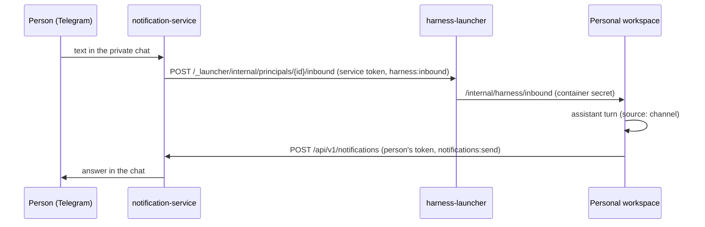

# Assistant in Telegram

Telegram is the second surface of the same conversation with the assistant as the
[assistant](../operator/assistant.md) panel in the console: what you write to the bot goes
into the conversation, the answer comes back to the chat, and you can confirm actions with a
button. The article is for the person who uses the assistant and for the administrator who
enables it. Rationale: TAI-ADR-0051 (item 7) and TAI-ADR-0050.

## What the person sees

- **Write to the assistant.** Any text (not a command) in the private chat with the bot
  becomes a message in your single conversation. The assistant's answer arrives in the same
  chat and is visible in the console's assistant panel — it is one conversation.
- **A long answer** is truncated in Telegram with an "Open window" link — it opens the console
  with the assistant panel, where the full answer is visible.
- **Confirming an action.** If the assistant needs your confirmation in this turn (to create a
  task, accept a result, invoke a skill), the bot sends a message with Allow and Decline
  buttons. The same request is visible in the console panel: the first answer counts.
- **Platform notifications** (decisions, results under review) arrive as before — see
  [Telegram](../notifications/telegram.md).

!!! note "No link, no delivery"
    Text from a Telegram account that is not linked to a user account goes no further than
    the notification service: the bot explains how to link the account. Messages in groups do
    not count as the conversation.

## How it works

- **Inbound.** notification-service finds the person by the linked account and passes the
  text to the launcher with its own service account (audience `human-harness`, scope
  `harness:inbound`). The launcher wakes the container if it was asleep and appends the
  message to the conversation.
- **Answer.** The personal workspace sends the turn's last answer as a notification to the
  person themselves, with the person's own token (audience `notification-service`, scope
  `notifications:send`). The channel is chosen according to the person's preferences.
- **Confirmation.** The buttons carry `data.kind = "harness_approval"` and a random
  `requestId`. A press is accepted only in the addressee's private chat, is recorded once per
  callback, and is returned through the same inbound as `{approval: {id, decision}}`. The
  personal workspace knows only its own `requestId` values: someone else's or a late press
  changes nothing. If the channel is unavailable, the request stays with the console panel.

## Enabling

You need the `notify` and `harness` profiles (see [Personal workspace](index.md)) and a
configured bot ([Telegram](../notifications/telegram.md)).

| What | Where |
|---|---|
| Launcher address for the notification service | `NS_HARNESS_LAUNCHER_URL` (in compose — `http://harness-launcher:8080/harness`) |
| Permission of the notification service's service account | audience `human-harness`, scope `harness:inbound` — registered by bootstrap; when the ceiling grows, it reissues the service account |
| The person's permission to send notifications to themselves | The person's PAT for the `control-plane` and `notification-service` audiences (`notifications:send`) — bootstrap, the `--harness-people` step; the old PAT is reissued when the ceiling changes |
| Notification service address for the personal workspace | `HARNESS_NOTIFY_URL` in `LAUNCHER_HARNESS_ENV` |
| Where "Open window" leads | By default `<LAUNCHER_PUBLIC_URL host>/console/?assistant=open`; your own address — `LAUNCHER_WINDOW_URL` on the launcher (the container gets it as `HARNESS_WINDOW_URL`) |

After the PAT is reissued, the person's container must be recreated (`docker rm -f
harness-<principal-id>`; the volume with the conversation remains) — the launcher creates it
again with the new environment on the next request.

## Common problems

| Symptom | Cause |
|---|---|
| The bot answers "not linked" | The account is not linked or was unlinked (`/unlink`) — link it with a code from the web interface |
| "The assistant is currently unavailable" | The launcher did not answer, or the notification service did not get a service token (no `human-harness` audience) |
| "No personal workspace with an assistant" | The person is not in the launcher's people registry |
| The text arrived, but there is no answer in the chat | The person's PAT lacks the `notification-service` audience — reissue it (bootstrap) and recreate the container |

## See also

- [Assistant](../operator/assistant.md)
- [Personal workspace](index.md)
- [Telegram](../notifications/telegram.md)
- [Notifications](../notifications/index.md)
