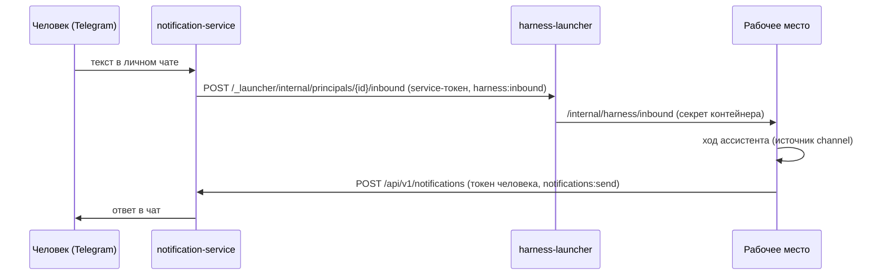

# Ассистент в Telegram

Telegram — вторая поверхность той же беседы с ассистентом, что и панель
[ассистента](../operator/assistant.md) в консоли: написанное боту приходит в беседу, ответ
возвращается в чат, а подтверждения действий можно дать кнопкой. Статья для человека, который пользуется ассистентом, и
для администратора, который это включает. Обоснование — TAI-ADR-0051 (п.7) и
TAI-ADR-0050.

## Что видит человек

- **Написать ассистенту.** Любой текст (не команда) в личном чате с ботом становится
  репликой в вашей единственной беседе. Ответ ассистента придёт в этот же чат и будет
  виден в панели ассистента консоли — беседа одна.
- **Длинный ответ** в Telegram обрезается со ссылкой «Открыть окно» — она открывает
  консоль с панелью ассистента, где ответ виден целиком.
- **Подтверждение действия.** Если ассистенту в этом ходе нужно ваше подтверждение
  (создать задачу, принять результат, вызвать скилл), бот пришлёт сообщение с кнопками
  «Разрешить» и «Отклонить». Тот же запрос виден в панели консоли: засчитывается
  первый ответ.
- **Уведомления платформы** (решения, результаты на проверке) приходят как раньше —
  см. [Telegram](../notifications/telegram.md).

!!! note "Без привязки — никуда"
    Текст из аккаунта Telegram, не привязанного к учётной записи, дальше сервиса
    уведомлений не уходит: бот подскажет, как привязать аккаунт. Сообщения в группах
    беседой не считаются.

## Как это устроено

- **Вход.** notification-service находит человека по привязанному аккаунту и передаёт
  текст launcher'у своим service account (audience `human-harness`, scope
  `harness:inbound`). Launcher будит контейнер, если он спал, и дописывает реплику в
  беседу.
- **Ответ.** Рабочее место отправляет последний ответ хода уведомлением самому человеку
  его собственным токеном (audience `notification-service`, scope `notifications:send`).
  Канал выбирается по предпочтениям человека.
- **Подтверждение.** Кнопки несут `data.kind = "harness_approval"` и случайный
  `requestId`. Нажатие принимается только в личном чате адресата, записывается один раз
  на callback и возвращается тем же inbound как `{approval: {id, decision}}`. Рабочее
  место знает только свои `requestId`: чужое или запоздалое нажатие ничего не меняет.
  Если канал недоступен, запрос остаётся за панелью консоли.

## Включение

Нужны профили `notify` и `harness` (см. [Рабочее место человека](index.md)) и
настроенный бот ([Telegram](../notifications/telegram.md)).

| Что | Где |
|---|---|
| Адрес launcher'а для сервиса уведомлений | `NS_HARNESS_LAUNCHER_URL` (в compose — `http://harness-launcher:8080/harness`) |
| Право service account сервиса уведомлений | audience `human-harness`, scope `harness:inbound` — заводит bootstrap; при росте потолка он перевыпускает service account |
| Право человека отправлять себе уведомления | PAT человека на audiences `control-plane` и `notification-service` (`notifications:send`) — bootstrap, шаг `--harness-people`; старый PAT перевыпускается при смене потолка |
| Адрес сервиса уведомлений для рабочего места | `HARNESS_NOTIFY_URL` в `LAUNCHER_HARNESS_ENV` |
| Куда ведёт «Открыть окно» | По умолчанию `<хост LAUNCHER_PUBLIC_URL>/console/?assistant=open`; свой адрес — `LAUNCHER_WINDOW_URL` у launcher'а (контейнер получает его как `HARNESS_WINDOW_URL`) |

После перевыпуска PAT контейнер человека нужно пересоздать (`docker rm -f
harness-<principal-id>`, volume с беседой остаётся) — launcher создаст его заново с
новым окружением при следующем запросе.

## Типичные проблемы

| Симптом | Причина |
|---|---|
| Бот отвечает «не привязан» | Аккаунт не привязан или отвязан (`/unlink`) — привязать кодом из веб-интерфейса |
| «Ассистент сейчас недоступен» | launcher не ответил или сервис уведомлений не получил service-токен (нет audience `human-harness`) |
| «Нет рабочего места с ассистентом» | Человека нет в реестре людей launcher'а |
| Текст дошёл, ответа в чате нет | PAT человека без audience `notification-service` — перевыпустить (bootstrap) и пересоздать контейнер |

## См. также

- [Ассистент](../operator/assistant.md)
- [Рабочее место человека](index.md)
- [Telegram](../notifications/telegram.md)
- [Уведомления](../notifications/index.md)
